  

 

  
  
  

---

## About Me

- 🔭 Direct-PhD student in China
- 🧠 Focus on Vision Language Models (VLMs)
- 🧩 Researching multimodal architecture design
- ⚙️ Working on parameter-efficient fine-tuning (PEFT)

---

## Daily Work

- 🖥️ Main server and cluster administrator
- 🛠️ Build automation tools for ops workflows
- 📈 Keep infrastructure stable while improving iteration speed
- 🔧 Develop practical internal tools for research teams

---

## Tech Stack

- 🐍 Python / PyTorch
- 🐧 Linux / Bash
- 🐳 Docker / Kubernetes
- 🌿 Git / GitHub / VS Code

---

## Interests

- 🎬 Mystery and thriller films
- ♟️ Board games and strategy games
- 💪 Fitness and strength training

---

## Contact

- 📫 GitHub: [@Samsara-1999](https://github.com/Samsara-1999)
- 💬 Topics: VLMs, Multimodal Architecture, PEFT, Infra Engineering
- 🤝 Open to research collaboration and work opportunities

  

