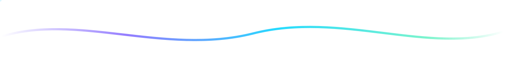

  

 

  <h1>Samsara</h1>
  
Multimodal LLM post-training · Agentic RL · VLM systems

  
  
  

---

## Research Orbit

  
  
  
  

## Research Profile

I am a direct PhD student in Computer Science at Harbin Institute of Technology. My work focuses on post-training for language and multimodal models, with an emphasis on Agentic RL, online policy distillation, data flywheels, reward modeling, and efficient training and inference.

## Research Interests

- Agentic RL and online policy distillation
- Vision-language and multimodal model post-training
- Data valuation, trajectory evaluation, and curriculum sampling
- High-performance model training and inference
- Speech-language and vision-language model architecture
- Parameter-efficient fine-tuning

## Experience

<table>
  <tr>
    <td valign="top" width="25%">
       
      <b>Alibaba Group · Qwen</b>
    </td>
    <td valign="top">
      Multimodal LLM post-training, Agentic RL, reward modeling, data evaluation, and online policy distillation workflows.
    </td>
  </tr>
  <tr>
    <td valign="top" width="25%">
       
       
      <b>Meituan · LongCat</b>
    </td>
    <td valign="top">
      Multimodal and speech foundation-model post-training, data-mixture design, scaling-aware validation, and multimodal representation studies.
    </td>
  </tr>
  <tr>
    <td valign="top" width="25%">
       
      <b>AI research infrastructure</b>
    </td>
    <td valign="top">
      GPU cluster administration, automation tools, and reliable training workflows for research teams.
    </td>
  </tr>
</table>

## Selected Publications

- **Twin-T & TwintVQA** — CVPR 2026
- **BISCUIT** — AAAI 2026
- **BOLT** — ACM Multimedia 2025
- **History Tracker** — ICME 2025
- **PAM-FOG Net** — ACM TOSN
- **Module Lightweighting and Path Transferring in Vision-Language Models** — SenSys 2024

See the [public research resume](resume.md) for the project summaries and full publication titles.

## Technical Stack

Python · PyTorch · Go · Linux · Bash · Docker · Kubernetes · distributed training · VLMs · Agentic RL · PEFT

## Selected Work

- [Bursar](https://github.com/atoz03/Bursar) — accounts and quotas for shared GPU clusters
- [BISCUIT](https://github.com/Samsara-1999/BISCUIT) — vision-language model research
- [Twin-T / TwintVQA](https://github.com/Samsara-1999/Twin-T-TwintVQA) — chart and table understanding research

## Contact

- GitHub: [@Samsara-1999](https://github.com/Samsara-1999)
- Open to research collaborations and engineering opportunities

  

